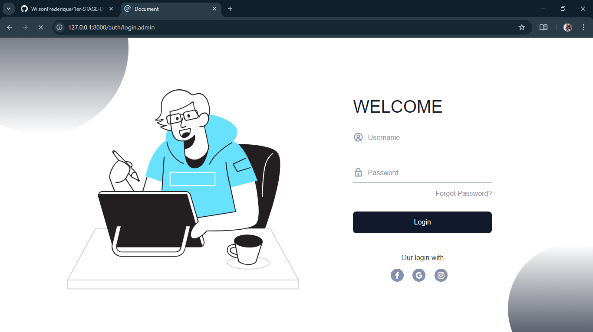
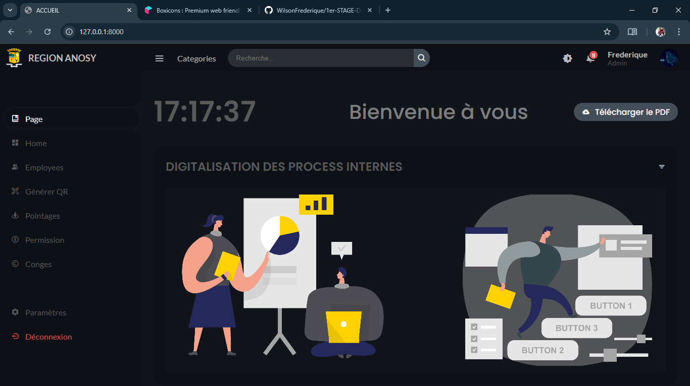
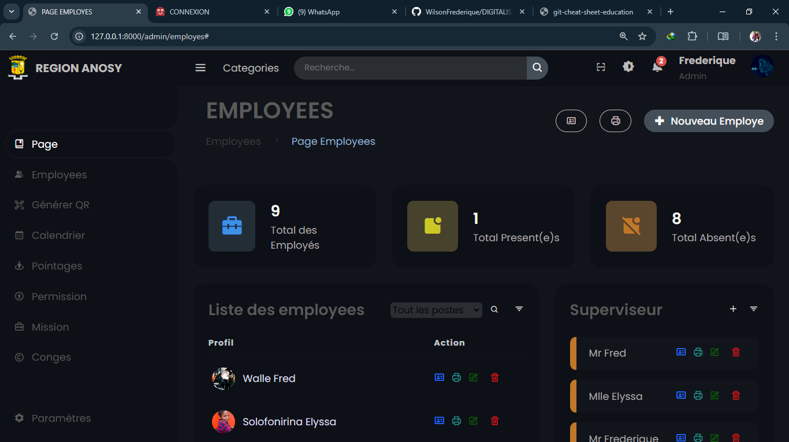
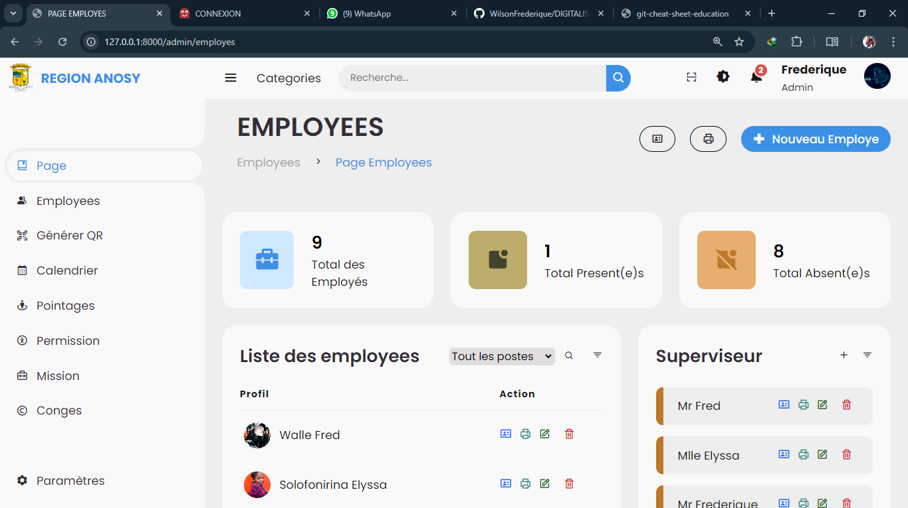
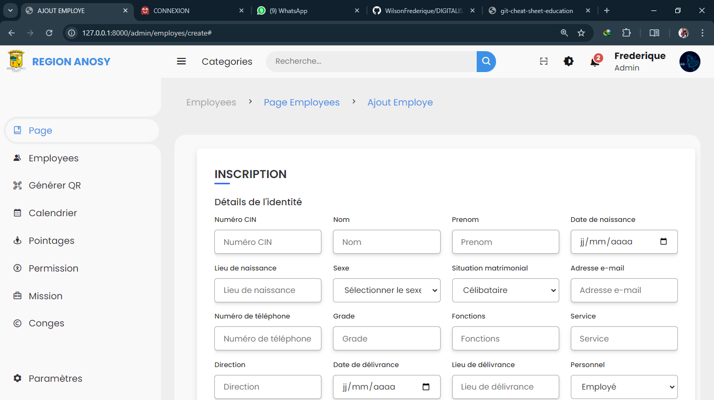
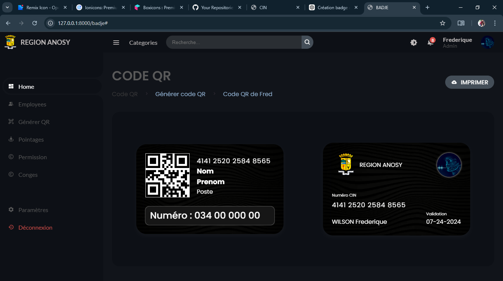

# APPLICATION WEB 

## Description & Installation

## Etap 1 : Description

Bienvenue :

======================================
PAGE POUR ADMINISTRATEUR 
======================================

Admin

Page des employés (mode sombre)

Page des employés (mode clair)

Page pour le formulaire 1er etap

Page pour le formulaire 2em etap

Page pour générer des codes QR (mode sombre)

Page pour Scanner un codes QR 

Page pour générer des codes QR (mode clair)

======================================
PAGE POUR UTILISATEUR 
======================================
Page pour CONNEXION

Page pour S'inscrire

-------------------------------------

## Etap 2 : Installation

========== INSTALLATION =============

Quelques commandes à executer dans le terminal du vs code avant de demarrer votre projet

1 : Veuillez ouvrir Git Bash et taper la commande suivante : 
    git clone https://github.com/WilsonFrederique/DIGITALISATION.git
    

    ou bien téléchargez le fichier en format .zip, puis extrayez-le.
    

2 : composer install

3 : php artisan key:generate

4 : créez un fichier .env sous dossier DIGITALISATION puis copiez les contenu de fichier .env.example et collez dans le nouveau fichier .env, en suite: 

    DB_CONNECTION=mysql
    DB_HOST=127.0.0.1
    DB_PORT=3306
    DB_DATABASE=digitalisation ( Nom de la base de donnée )
    DB_USERNAME=root
    DB_PASSWORD=

modifiez-les par rapport à votre SGBD

5 : php artisan migrate  

6 : php artisan serve

    Ex : PS C:\xampp\htdocs\PROJET\LARAVEL\DIGITALISATION> php artisan serve

         INFO  Server running on [http://127.0.0.1:8000].  

         Press Ctrl+C to stop the server

Maintenant copiez ce lien : http://127.0.0.1:8000 et collez dans votre navigateur

---------------------------------------